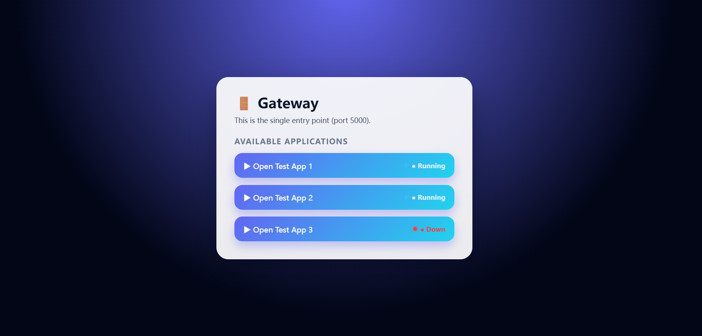

# 🚪 Gateway — Lightweight Application Portal with Health Monitoring

A lightweight **Flask-based Gateway** that serves as a single entry point for multiple backend applications.  
The Gateway provides a clean, responsive UI and performs **real-time health checks** to display the running status of each application.

This project is designed as a practical demonstration of **service orchestration, frontend–backend integration, and system-level thinking**.

---

## ✨ Features

- 🔗 **Single Entry Point**
  - All applications are accessed from one central gateway (port `5000`).

- 🩺 **Real-Time Health Monitoring**
  - Each application exposes a `/health` endpoint.
  - Gateway automatically detects and displays:
    - 🟢 Running
    - 🔴 Down

- 🧭 **Non-Intrusive Design**
  - Gateway does not interfere with application logic.
  - Each app runs independently.

- 🖥️ **Modern UI**
  - Clean, SaaS-style card layout
  - Hover & active interactions
  - Status indicators with visual feedback

- 📱 **Mobile Responsive**
  - Fully usable on mobile devices
  - Touch-friendly layout and typography

- 🔐 **Safe Navigation**
  - Applications open in new browser tabs
  - Uses `noopener noreferrer` for security

---

## 🏗️ Architecture Overview

```
Browser
   |
   |  (HTTP :5000)
   v
Gateway (Flask)
   |
   |-- /app1  ---> App 1 (Flask / FastAPI)
   |-- /app2  ---> App 2 (Flask / FastAPI)
   |-- /app3  ---> App 3 (Flask / FastAPI)

Health Checks:
   /app1/health
   /app2/health
   /app3/health
```

---

## 🚀 Getting Started

### 1️⃣ Clone the Repository

```bash
git clone https://github.com/your-username/gateway.git
cd gateway
```

---

### 2️⃣ Create and Activate Virtual Environment (Optional but Recommended)

```bash
python -m venv venv
source venv/bin/activate  # macOS / Linux
venv\Scripts\activate     # Windows
```

---

### 3️⃣ Install Dependencies

```bash
pip install flask
```

---

### 4️⃣ Run the Gateway

```bash
python gateway.py
```

The Gateway will be available at:

```
http://localhost:5000
```

---

## 🩺 Health Check Requirement

Each application must expose a health endpoint:

```python
@app.route("/health")
def health():
    return {"status": "ok"}
```

The Gateway automatically maps this to:

```
/appX/health
```

If the endpoint:
- returns HTTP 200 → **Running**
- fails or times out → **Down**

---

## 📁 Example Project Structure

```
gateway/
│
├── gateway.py
├── static/
│   └── style.css
├── templates/
│   └── index.html
└── README.md
```

---

## 🧠 Design Decisions

- **Frontend-based health check**
  - Keeps the Gateway lightweight
  - Avoids unnecessary backend polling

- **Decoupled services**
  - Applications can be restarted or replaced independently

- **Production-inspired UI**
  - Inspired by real-world SaaS dashboards and service portals

---

## 🔮 Possible Enhancements

- 🔁 Periodic health refresh (polling every N seconds)
- 📊 Aggregated service status (e.g. `3 / 4 services online`)
- 🔐 Authentication / authorization layer
- 🐳 Docker & Docker Compose support
- ⚡ FastAPI + async health checks
- 🌙 Dark / Light theme toggle

---

## 👤 Author

**Eric Morcy**  
Master of Artificial Intelligence  
Memorial University of Newfoundland

---

## 📄 License

This project is open for learning and demonstration purposes.
Feel free to fork and adapt.
